# TariffNom System - UML Diagrams

## How to Use These Diagrams

The diagrams below are in **Mermaid** syntax. You can:
1. Copy and paste into https://mermaid.live/ to view/edit
2. Use Mermaid plugins in VS Code
3. Convert to PNG/SVG for documentation

---

## 1. System Component Diagram

---

## 2. Tariff Calculation Class Diagram

---

## 3. Exchange Rate Analysis Class Diagram

---

## 4. Predictive Analysis Class Diagram

---

## 5. Security Architecture Diagram

---

## 6. Sequence Diagram: Tariff Calculation Flow

---

## 7. Sequence Diagram: Exchange Rate Analysis Flow

---

## 8. Sequence Diagram: Predictive Analysis Flow

```mermaid
sequenceDiagram
    actor User
    participant Frontend
    participant PredictiveController
    participant PredictiveService
    participant NewsAPIService
    participant SentimentService
    participant ExchangeRateService
    participant NewsAPI
    participant Database
    
    User->>Frontend: Click "Get Prediction"
    Frontend->>PredictiveController: GET /predict?enableNewsAnalysis=true
    activate PredictiveController
    
    PredictiveController->>PredictiveService: analyzePrediction(request)
    activate PredictiveService
    
    alt Enable News Analysis = true
        PredictiveService->>NewsAPIService: fetchTradeNews(7 days)
        activate NewsAPIService
        
        NewsAPIService->>NewsAPI: GET /everything?q=trade...
        activate NewsAPI
        NewsAPI-->>NewsAPIService: JSON (articles)
        deactivate NewsAPI
        
        NewsAPIService->>NewsAPIService: Parse articles
        NewsAPIService->>Database: Check duplicates
        NewsAPIService-->>PredictiveService: List<NewsArticle>
        deactivate NewsAPIService
        
        PredictiveService->>SentimentService: processArticleSentiments(articles)
        activate SentimentService
        
        loop For each article
            SentimentService->>SentimentService: Analyze sentiment (keyword matching)
        end
        
        SentimentService->>Database: Save articles with scores
        SentimentService->>SentimentService: calculateWeeklySentiment()
        SentimentService->>Database: Save weekly aggregate
        SentimentService-->>PredictiveService: Done
        deactivate SentimentService
    end
    
    PredictiveService->>Database: Get latest sentiment
    Database-->>PredictiveService: SentimentAnalysis
    
    PredictiveService->>ExchangeRateService: Get current rate
    ExchangeRateService->>Database: Query latest rate
    Database-->>ExchangeRateService: ExchangeRate
    ExchangeRateService-->>PredictiveService: Rate data
    
    PredictiveService->>PredictiveService: Generate prediction
    Note over PredictiveService: Multi-factor scoring:<br/>• Sentiment (40%)<br/>• Trend (30%)<br/>• Volatility (20%)<br/>• Consistency (10%)
    
    PredictiveService->>PredictiveService: Determine BUY/HOLD/WAIT
    PredictiveService->>Database: Get supporting headlines
    Database-->>PredictiveService: Recent articles
    
    PredictiveService-->>PredictiveController: PredictiveAnalysisResponse
    deactivate PredictiveService
    
    PredictiveController-->>Frontend: JSON Response
    deactivate PredictiveController
    
    Frontend->>User: Display recommendation
```

---

## 9. Authentication Sequence Diagram

---

## 10. Data Model ER Diagram

---

## 11. Service Dependency Diagram

---

## 12. Deployment Diagram

---

## 13. Package Structure Diagram

---

## 14. Class Diagram: Core Domain Models

---

## Notes

### Diagram Tools

**To view/edit these diagrams:**
1. **Online**: Copy to https://mermaid.live/
2. **VS Code**: Install "Mermaid Preview" extension
3. **Export**: Use mermaid-cli or online tools to generate PNG/SVG

### Customization

You can modify these diagrams to:
- Add more details
- Show specific flows
- Highlight your contributions
- Focus on particular features

### Documentation Best Practices

**For your report, include:**
1. Component diagram (shows overall system)
2. 1-2 sequence diagrams (shows key flows)
3. Class diagram (shows main entities)
4. Brief text explanation of each

This makes your architecture clear and professional! 🎯

